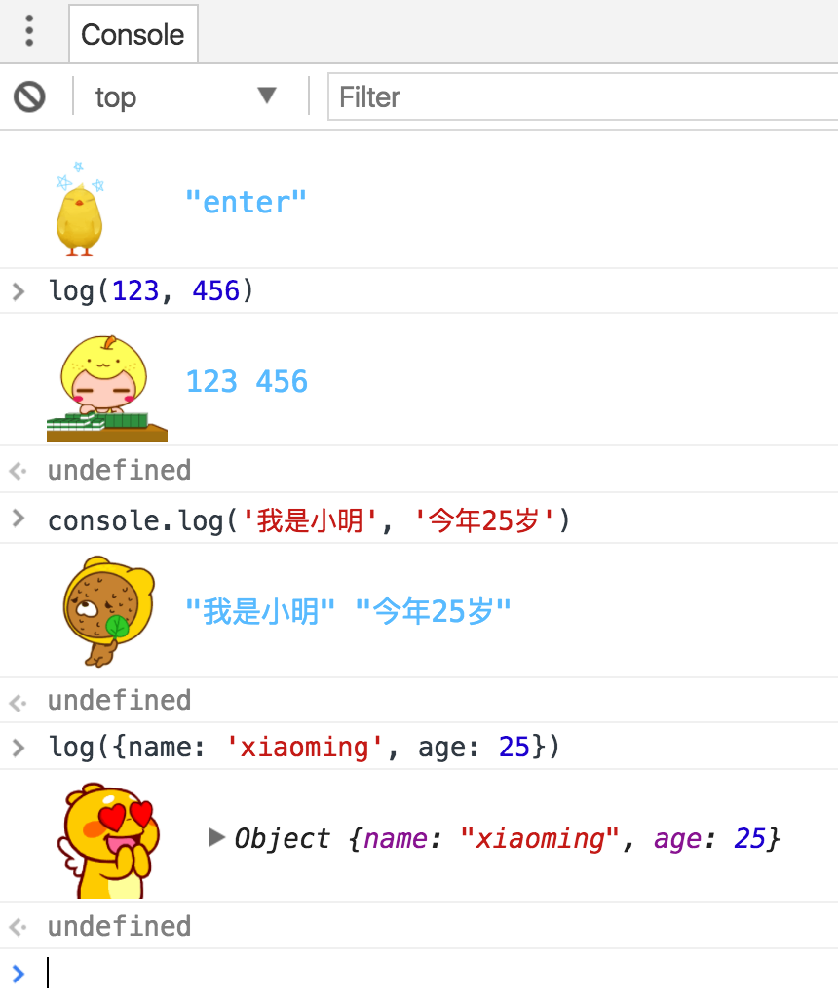

# console
rewrite the origin console.log

# use
console.log()
or
log()

# params
### window.consoleParams = {
  ###   hideLog: , // default false
  ###   color: '', // default '#58baff'
  ###   fontSize: '', // default '12px'
  ###   height: , // default 50
  ###   backgroundUrl: '', // default Array
### }

if hideLog is true, all the logs will be hide, it's for the production environment. You can try other params to know their use. Any suggestion or problem, pls feel free to contact me.E-mail:447462224@qq.com. Thank you!

这是一个重写控制台console.log的方法，因为实在用的太多了，你也可以使用log方法。不必注释或者删除掉多有log，只需将hidelog改为true，这将会对开发有意。其他参数请您自己尝试，希望对您枯燥的编码工作带来一丝乐趣。如果您有建议或者问题，请提issue或者邮箱我。447462224@qq.com 谢谢
